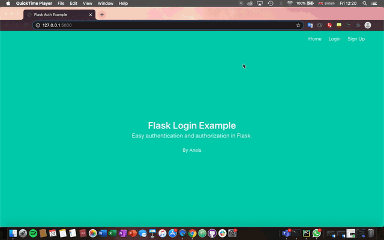

# Flask Login Page Project 




## Project Directory
```bash
└── flask_autho_app
    └── project
        ├── __init__.py       # initialising app and db with Blueprint and SQLAlchemy
        ├── auth.py           # auth routes for the app
        ├── db.sqlite         # sqlite3 database (SQLAlchemy)
        ├── main.py           # non-auth routes for the app
        ├── models.py         # user model (creating the table)
        └── templates
            ├── base.html     # contains common layout and links (using bulma css)
            ├── index.html    # home page
            ├── login.html    # login html form
            ├── profile.html  # login successful html page
            └── signup.html   # signup html form
```

## Installing relevant packages
- **Flask**
- **Flask-Login**: to handle user sessions (the presence of a user with a specific IP address)  
    - Sessions create a file in a temporary directory on the server where registered session variables and values (username, password) are stored
    - Cookies are stored in client-side machine
- **Flask-SQLAlchemy**: to represent the user model and interface with the database

## Creating a python environment for our project directory 
```bash
$ python3 -m venv auth
$ auth/bin/activate
(auth) $ pip install flask flask-sqlalchemy flask-login
```

## Flask modules used for this project
```python
from flask import Blueprint, render_template, redirect, url_for, request, flash
from sqlalchemy import SQLAlchemy
from flask_login import login_user, logout_user, login_required
from werkzeug.security import generate_password_hash, check_password_hash
```

## Creating the Main App File 

```python
from flask import Flask
from flask_sqlalchemy import SQLAlchemy

# initialising SQLAlchemy for the user models
db = SQLAlchemy()

def create_app():
    app = Flask(__name__)

    app.config['SECRET_KEY'] = 'secret-key-goes-here'
    app.config['SQLALCHEMY_DATABASE_URI'] = 'sqlite:///db.sqlite' # connect to local database

    db.init_app(app)

    # blueprint for auth routes in our app
    from .auth import auth as auth_blueprint
    app.register_blueprint(auth_blueprint)

    # blueprint for non-auth parts of app
    from .main import main as main_blueprint
    app.register_blueprint(main_blueprint)

    return app
```

**If table has not been created in the database, remove and create the database again:**
```bash
rm project/db.sqlite
```

**Run python**
```bash
python3
```

**Import instantiated object of SQLAlchemy and function to create table in** `__init__.py`
```bash
>>> from project import db, create_app
>>> db.create_all(app=create_app())
>>> exit()
```

**Run sqlite3 to check the table has been created**
```bash
sqlite3 project/db.sqlite
sqlite> .tables
user
sqlite> .exit
```

## Adding Routes 
I used two blueprints: The [home page `(/)`](project/templates/index.html) and the [profile page `(/profile)`](project/templates/profile.html) for after logging in. If the user tries to access the profile page without logging in, they will be sent to the login route.

## To run our app
```bash
(auth) $ export FLASK_APP=project
(auth) $ export FLASK_DEBUG=1
(auth) $ export flask run
```

If you already have a process bound to the default port (5000), locate the process:
```bash
$ ps -fA | grep python
```

## Using Flask_SQLAlchemy
- SQLAlchemy allows you to define the database schema in Python
- The python code that defines your schema is called the model
    - The class represents the table `User` and inherits the initialised database
- SQLAlchemy also presents database relations in a Pythonic way:
```python
for e in User.email:
    print(e.email, e.id)
```

```python
from flask_login import UserMixin
from . import db

class User(UserMixin, db.Model):
    id = db.Column(db.Integer, primary_key=True) # primary keys are required by SQLAlchemy
    email = db.Column(db.String(100), unique=True)
    password = db.Column(db.String(100))
    name = db.Column(db.String(1000))
```

## Testing the Sign Up Method with flash messages 
```python
from flask import flash, redirect, url_for

@auth.route('/signup', methods=['POST'])
def signup_post():
    
    if user:
    # if a user is found, it will redirect back to signup page so the user can try again 
        flash('Email address already exists')
        return redirect(url_for('auth.signup'))
```

**Using Jinja syntax in HTML**
```html


    <div class="notification is-danger">
        {{ messages[0] }}. Go to <a href="{{ url_for('auth.login') }}">login page</a>.
    </div>


```

## Adding customised 404 Error Page (URL does not exist)
```python
from flask import FLask, render_template

app = Flask(__name__)

# python decorator to take error as a parameter
@app.errorhandler(404)
# defining function
def page_not_found(error):
    return render_template('page_not_found.html'), 404
```

[`page_not_found.html`](project/templates/page_not_found.html)

```html


Page Not Found




  <h1 class="title">Page Not Found</h1>
  <p class="lead">We couldn't find what you are looking for. Come visit the homepage :)</p>
  <p>
    <!--syntax for code-->
    <a href="{{ url_for('project.index') }}"><button class="btn btn-primary my-2">Home</button></a>
  </p>

```

## Troubleshooting `ModuleNotFoundError`
**Go to the terminal**
```bash
$ pip install <package>
$ pip3 install <package>
```

